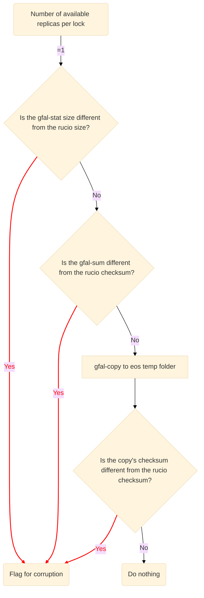
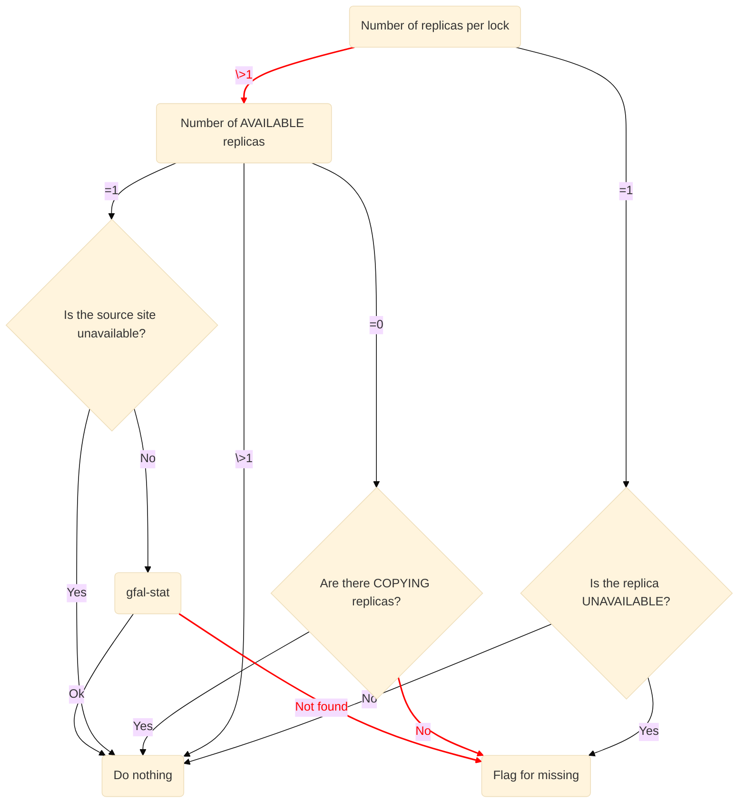
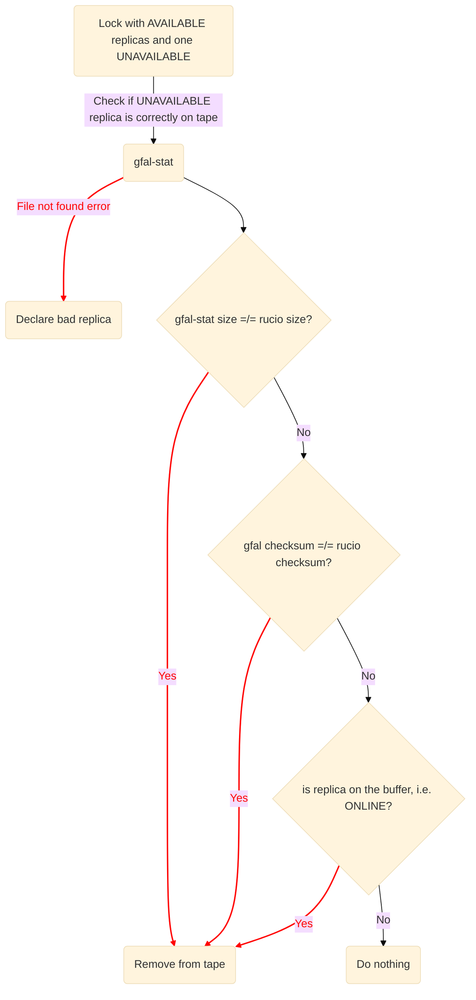

## STUCK/SUSPENDED rule handler

This tool is meant to handle stuck and suspended tape rules and has been developed after studying the main issues with Production Output tape rules. By default, it filters for rules created by `wmcore_output` account but this can be changed in `run_handler.py`.

The tool should be used to tackle the error cases which can be automated but more specific cases may require special attention and communication with the sites.

Below, the five usage modes are described.

For the modes that handle errors automatically (possibly-missing, possibly-corrupt, file-exists), enum classes can be found in `utils.py` with the complete rucio error.

### List generation mode

`python3 run_handler.py list-generation [--only-suspended]`

This mode generates a list of currently stuck and suspended rules (or only suspended if `--only-suspended` flag is used). It uses the rucio client to generate such a list as well as the DBS API for the file and dataset sizes. It generates a file in the current directory named `locks_suspended_rules.csv` or `locks_stuck_rules.csv` with the following columns: _rule_id, rse, file_name, dataset, rule_size, error, file_size_. The generation of said list is crucial for the following modes as it is the primary input so if the `locks_suspended_rules.csv` file is not found, this mode will be triggered automatically.

### Overview mode

`python3 run_handler.py overview [--input-file PATH_INPUT_FILE] [--rse RSE]`

This mode provides a summary of the stuck locks by error and per site. If an RSE is specified, it provides a summary of the stuck locks by error at this specific site. This summary includes the name of the error, the total stuck rule size (in PB) and number and the actual stuck file size (in PB) and number.

### Automatic invalidation based on PnR threshold

`python3 run_handler.py threshold-invalidation [--input-file PATH_INPUT_FILE]`

This mode generates a JSON that provides the stuck locks per dataset divided in chunks. This JSON should be passed down in the future to PnR API to determine if the files are good to invalidate. 

> [!NOTE]
> This mode is not complete and is missing the PnR API

### Possibly corrupt mode

`python3 run_handler.py possibly-corrupt --rse [RSE]  [--input-file PATH_INPUT_FILE] [--file-list]`

This mode handles the checksum mismatch errors and verifies which of those locks are in fact corrupt and up for invalidation. It only handles cases in which there is only one available replica. It checks for differences in the size reported by rucio, then on the checksum reported by rucio and lastly it copies the file onto a temporary location to check its checksum. If any of these "tests" do not correspond to the values reported by rucio, it is marked as corrupt and saved into a list `df_corrupt_{RSE}.csv` marked for global invalidation.

If the `--file-list` flag is used and an `--input-file` is passed, the path must point to a text file with a list of LFNs whose corruption status will be analyzed. It does not require information about rules or RSEs.

> [!NOTE]
> Currently, this mode only generates a list of replicas to invalidate globally, but does not act on them.

### Possibly missing mode

`python3 run_handler.py possibly-missing --rse [RSE] [--input-file PATH_INPUT_FILE]  [--file-list]`

This mode handles the file not found and no sources errors and verifies which of those locks are in fact lost and up for invalidation. It checks the total number of replicas across all sites and confirms their alleged availability as shown in the diagram bellow. If the replicas are found to be lost everywhere, it flags them for missing and saves them into a list `df_missing_{RSE}.csv` which should be invalidated globally.

> [!NOTE]
> Currently, this mode only generates a list of replicas to invalidate globally, but does not act on them.

### File exists errors

`python3 run_handler.py file-exists --rse [RSE] [--input-file PATH_INPUT_FILE] [--dry-run]`
`python3 run_handler.py file-exists --rse [RSE] [--input-file PATH_INPUT_FILE] [--dry-run]`

This mode should solve file exists errors. It does so by checking locks which are incorrectly on the tape buffer at a specific RSE. This implies that it is limited to check those locks that have one or more AVAILABLE replica and only one UNAVAILABLE (which is presumed to be incorrectly transferred to tape). If a file is found to be corrupt or stuck on the buffer, it deletes it using `gfal-rm`. If it is not found using `gfal-stat`, it declares the PFN as bad. Refer to the diagram below for details. After files have been removed, it updates all suspended rules to stuck. 
This mode should solve file exists errors. It does so by checking locks which are incorrectly on the tape buffer at a specific RSE. This implies that it is limited to check those locks that have one or more AVAILABLE replica and only one UNAVAILABLE (which is presumed to be incorrectly transferred to tape). If a file is found to be corrupt or stuck on the buffer, it deletes it using `gfal-rm`. If it is not found using `gfal-stat`, it declares the PFN as bad. Refer to the diagram below for details. After files have been removed, it updates all suspended rules to stuck. 

> [!WARNING]
> This is the only mode that performs removal operations of tape files. Please test it out with dry-run for the time being.

### Force-retry

`python3 run_handler.py force-retry --rse RSE [--error ERROR] [--input-file PATH_INPUT_FILE]`
`python3 run_handler.py force-retry --rse RSE [--error ERROR] [--input-file PATH_INPUT_FILE]`

This mode updates all suspended rule of an RSE (preferably with a specific error type specified) to stuck.
